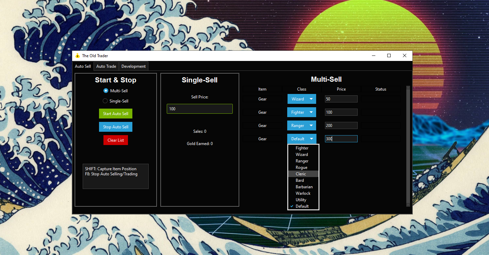

<p align="left">
  
  
</p>

# The Old Trader - Dark And Darker - Auto Trader

<p align="center">
  
</p>

Releasing a hobby project that i've used as a motivator to extend my coding knowledge.

Welcome to The Old Trader - Dark And Darker - Auto Trader, an automated trading and selling tool for your favorite online game! This Python-based application simplifies the trading process and makes your in-game life easier.

## Installation

Before you start using The Old Trader, make sure to install the required dependencies:

1. **Python**: Ensure you have Python 3.6 or higher installed on your system.

2. **Tesseract OCR**: You need to install Tesseract OCR for text recognition. Follow the installation guide [here](https://github.com/UB-Mannheim/tesseract/wiki).

3. **Python Dependencies**: Install the Python packages required for this project. You can use the following command:

```
pip install -r requirements.txt
```
Clone this repository to your local machine:
```
git clone https://github.com/TheOldHook/DND-AutoTrader.git
```
Navigate to the project directory:
```cd DND-AutoTrader```
Configure the application as needed (see Configuration).

Start the application:

```python autotrade.py```
Enjoy automated selling!

```Auto Trader Tab```
Using image rec to find images in chat that you can add and it will automaticly make trade requests, i made this because i was tired of being too late for a good item, but it needs some work and its not perfect.
You can do print screens WIN + SHIFT + S and crop out any item you usually buy, save it and load it here and it will automaticly try to scan within a zone at the bottom (You can toggle multiple images).

```Auto Sell Tab``` 
Choose to sell one item quick with "Single-Sell" or use the "Multi-sell" feature for automating going to different channels and pricing items (before pressing start).
SHIFT to select items position you want to sell before pressing start (must be done while in the trade channel).

Always start the trader when you are inside a tradechannel and you need to add the positions there because its compensating an offset when you get to the stash inside a trade (it changes location based on the DND UI), it will use OCR (Optical Character Recognition) to scan for the gold value added by the other player, and its adding the item (position) to the trade, clicking accept if the value is the same as you set as the price, click on all cells inside the buyers frame and clicking accept to close the deal.

This makes it easy to sell to other players while you are sleeping, cooking dinner, changing diapers, watching stream or whatever.
And when you get back you hopefully have a lot of gold that you can lose together with your friends in your next game.

Killswitch feature added that closes the script and the DND process after a given time.

Configuration
You can configure The Old Trader by modifying the settings in the source code as you like.

Dependencies
The Old Trader relies on the following Python packages:

```pyautogui: For automating mouse and keyboard actions.```
```keyboard: For handling keyboard events.```
```pillow: For working with images.```
```numpy: For numerical operations.```
```tesseract: For OCR (Optical Character Recognition) support.```


Contributing
We welcome contributions. If you find a bug, have a feature request, or want to contribute in any way, please open an issue or create a pull request.
This is far from perfect, but the time you find yourself using on selling items that stack up in your inventory is a lot.

I also want to point out that you are most likely not going to get banned using this software but use at your own risk.


<p align="center">
  Made by TheOldHook
</p>
```
