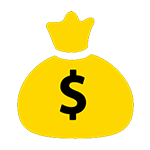

<p align="left">
  
  
</p>

# The Old Trader - Dark And Darker - Auto Trader


Welcome to The Old Trader - Dark And Darker - Auto Trader, an automated trading and selling tool for your favorite online game! This Python-based application simplifies the trading process and makes your in-game life easier.

## Table of Contents

- [Installation](#installation)
- [Usage](#usage)
- [Configuration](#configuration)
- [Dependencies](#dependencies)
- [Contributing](#contributing)
- [License](#license)

## Installation

Before you start using The Old Trader, make sure to install the required dependencies:

1. **Python**: Ensure you have Python 3.6 or higher installed on your system.

2. **Tesseract OCR**: You need to install Tesseract OCR for text recognition. Follow the installation guide [here](https://github.com/UB-Mannheim/tesseract/wiki).

3. **Python Dependencies**: Install the Python packages required for this project. You can use the following command:

   ```bash
   pip install -r requirements.txt
Usage
Clone this repository to your local machine:


Copy code
git clone https://github.com/TheOldHook/DND-AutoTrader.git
Navigate to the project directory:


```cd DND-AutoTrader```
Configure the application as needed (see Configuration).

Start the application:

```python autotrade.py```
Follow the on-screen instructions and in terminal and enjoy automated trading!

```Auto Trader Tab, is using image rec to find images in chat that you can add and it will automaticly make trade requests, i made this because i was tired of being too late for a good item```

```Auto Sell Tab, you can choose to only sell one item or if you want to use the more "advanced" multi-sell feature where you just use SHIFT to select items you want to sell (while in the trade channel)```

Configuration
You can configure The Old Trader by modifying the settings in the source code or by using command-line arguments. Customize the application to your preferences and trading needs.

Dependencies
The Old Trader relies on the following Python packages:

pyautogui: For automating mouse and keyboard actions.
keyboard: For handling keyboard events.
pillow: For working with images.
numpy: For numerical operations.
tesseract: For OCR (Optical Character Recognition) support.
Contributing
We welcome contributions from the community. If you find a bug, have a feature request, or want to contribute in any way, please open an issue or create a pull request.

License
This project is licensed under the MIT License. See the LICENSE file for details.

<p align="center">
  Made with ❤️ by TheOldHook
</p>
```
